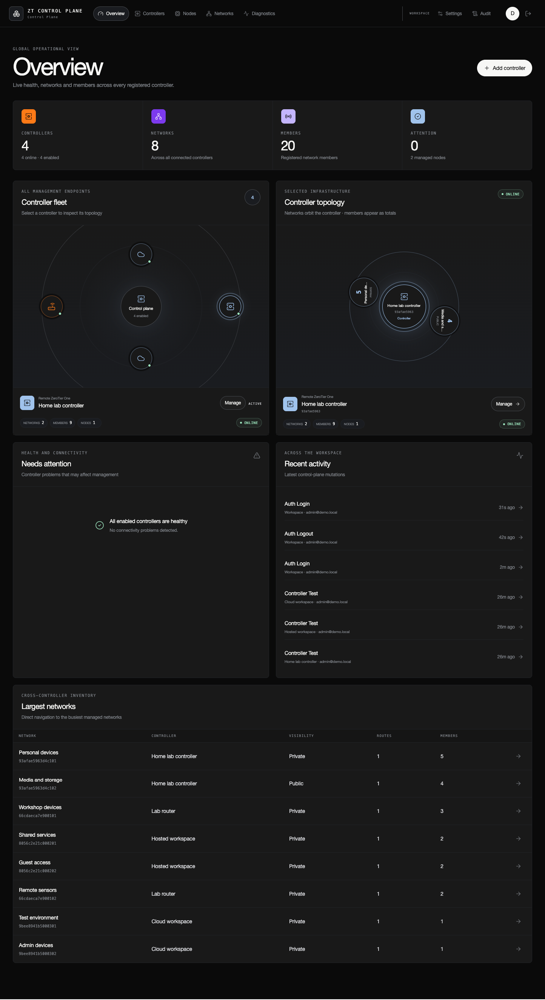
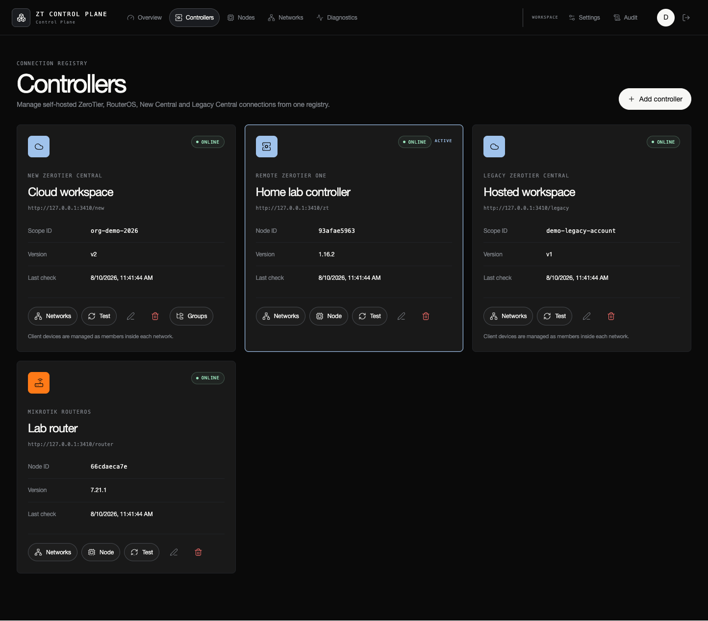
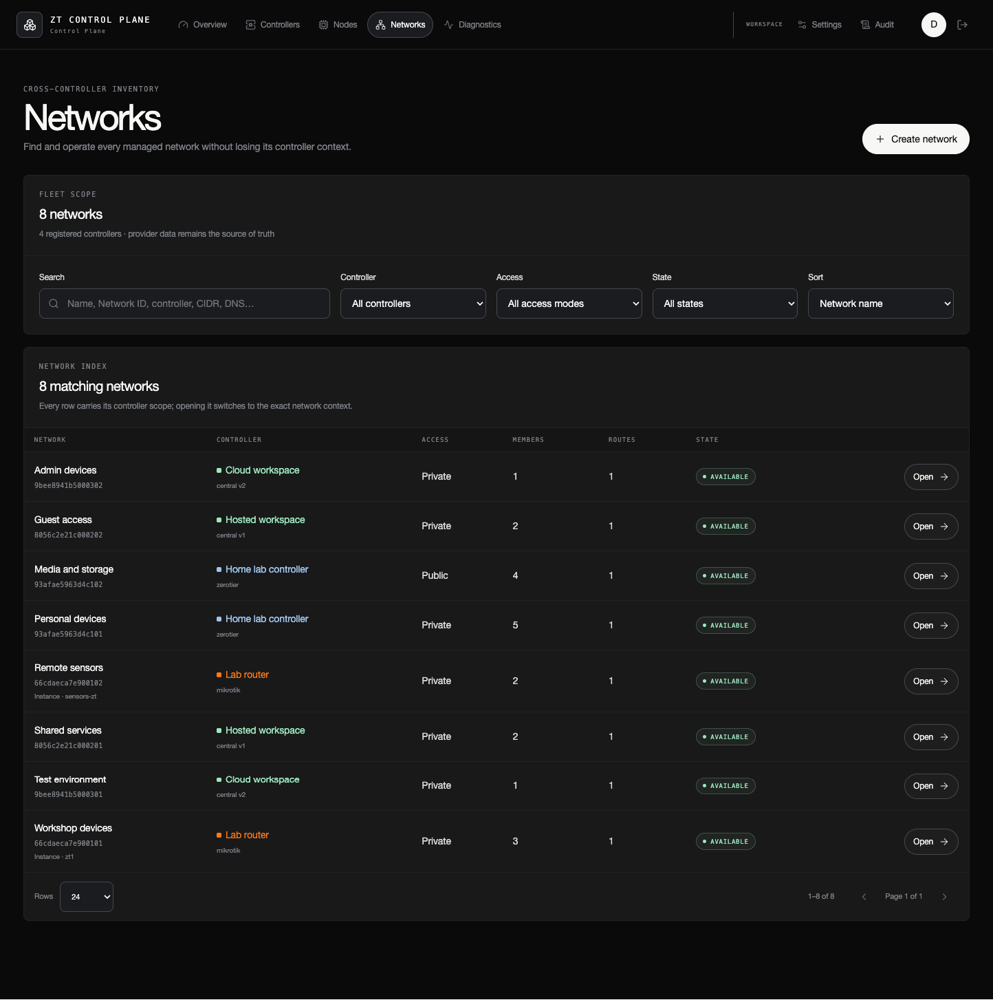
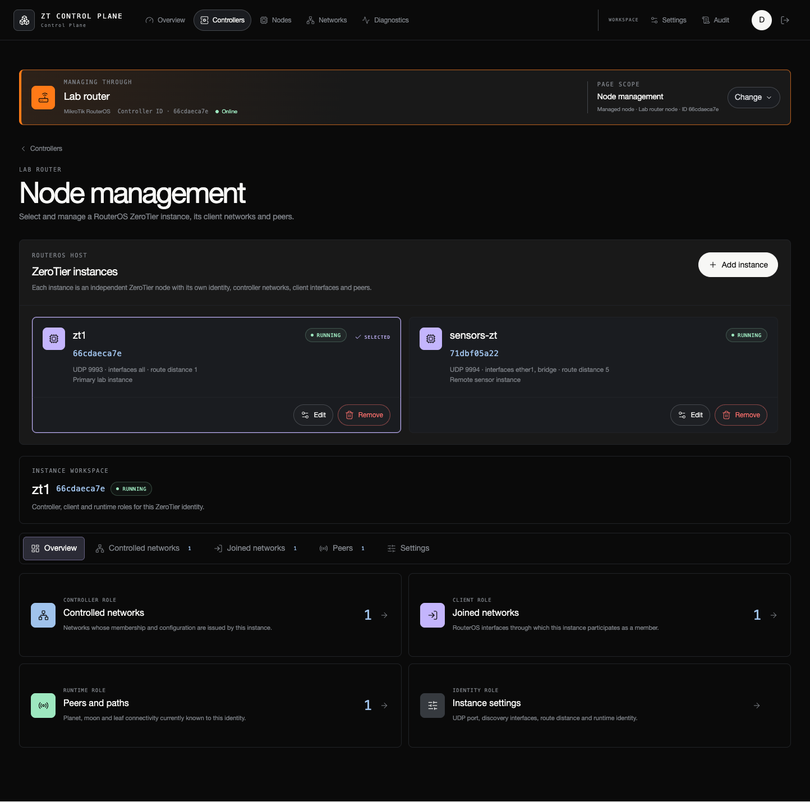
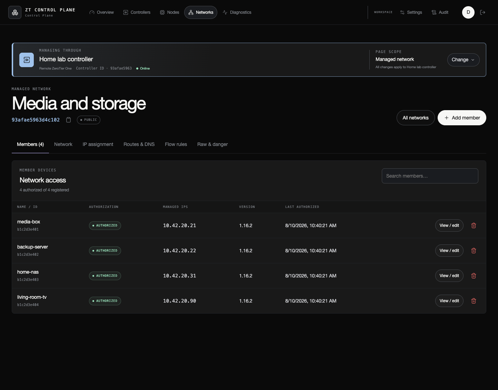

# ZT Control Plane

Bring your ZeroTier-compatible controllers, networks, and managed nodes into
one calm, private workspace. ZT Control Plane is a self-hosted web interface
for people who would rather manage their infrastructure from a clear dashboard
than jump between APIs, routers, and controller consoles.

Run it on your own Docker host, connect the controllers you already use, and
keep day-to-day network work in one place. The project is built to stay useful
whether you have one small lab or a growing collection of controllers.

> [!NOTE]
> ZT Control Plane is an independent community project, not an official
> ZeroTier product. “ZeroTier” is used only to describe interoperability; the
> project is not affiliated with, sponsored by, or endorsed by ZeroTier, Inc.

The standard Docker image contains the web application, REST API, and SQLite
database. It connects to remote ZeroTier One installations, MikroTik RouterOS,
New Central, and Legacy Central, using the management features each provider
makes available. It does **not** bundle ZeroTier One or its source-available
controller code.

For a self-contained lab, there is also an optional embedded-controller build.
It is deliberately separate from the open-source image because it uses ZeroTier
code covered by different upstream terms.

## See it at a glance

<p align="center">
  <a href="docs/INTERFACE_GALLERY.md">
    
  </a>
</p>

<p align="center">
  One workspace for controller health, networks, members and managed nodes.<br>
  <sub>Every controller, address, account and event shown here is fabricated demonstration data.</sub>
</p>

<table>
  <tr>
    <td width="50%">
      <a href="screenshots/controllers.png">
        
      </a>
      <br><sub><strong>Controller registry</strong> — keep provider context visible and switch safely between endpoints.</sub>
    </td>
    <td width="50%">
      <a href="screenshots/network-inventory.png">
        
      </a>
      <br><sub><strong>Network inventory</strong> — search every registered controller without losing ownership context.</sub>
    </td>
  </tr>
  <tr>
    <td width="50%">
      <a href="screenshots/node-routeros.png">
        
      </a>
      <br><sub><strong>RouterOS instances</strong> — distinguish controller, client, peer and runtime roles.</sub>
    </td>
    <td width="50%">
      <a href="screenshots/network-members.png">
        
      </a>
      <br><sub><strong>Member management</strong> — inspect authorization and managed addresses in the selected network.</sub>
    </td>
  </tr>
</table>

Explore the [complete interface gallery](docs/INTERFACE_GALLERY.md) for node
inventory, diagnostics, access control, roles, audit history and profile
management.

## What you can do

- Multi-controller registry with connection testing, encrypted credentials,
  active-controller context, and global network/node inventories.
- Network and member CRUD across remote ZeroTier One, RouterOS, New Central,
  and Legacy Central where supported by each provider.
- Multiple RouterOS ZeroTier instances with controller, client, peer, VRF,
  interface, route-policy, and member management.
- Routes, address pools, DNS, IPv6 modes, MTU, multicast, Flow Rules, tags,
  and capabilities according to provider support.
- Managed ZeroTier One and RouterOS client nodes, joined networks, peers,
  policies, and moon operations where exposed by the provider.
- SQLite persistence, AES-256-GCM credential encryption, roles, audit log,
  TOTP 2FA, recovery codes, backup/restore, diagnostics, and IP access rules.
- URL-persistent filters, tabs, and pagination with automatic visible-page
  refresh and cached discovery data during provider outages.

Providers expose different APIs, so the interface shows only controls that are
actually supported. The [capability matrix](docs/CAPABILITY_MATRIX.md) is the
quickest way to compare them.

## Start in a few minutes

Requirements: Docker Engine with Compose support. The supplied configuration
is tested on `linux/amd64`.

The recommended installation uses the versioned image published for the latest
release. Download the release Compose file and environment template:

```sh
curl -fsSLO https://raw.githubusercontent.com/dobria/zt-control-plane/v0.1.0/compose.release.yaml
curl -fsSLO https://raw.githubusercontent.com/dobria/zt-control-plane/v0.1.0/.env.example
cp .env.example .env
docker compose -f compose.release.yaml up -d
```

The Compose file pins `ghcr.io/dobria/zt-control-plane:0.1.0`. Review each new
release before changing that version. The image is built from the matching Git
tag and published with SBOM and provenance attestations.

To build the standard image from source instead:

```sh
git clone https://github.com/dobria/zt-control-plane.git
cd zt-control-plane
cp .env.example .env
docker compose up -d --build
```

Open <http://localhost:3100/setup>, copy the one-time setup token from the
application log, create the first administrator, and add your first controller.
You can set `APP_SETUP_TOKEN` yourself instead. If `APP_SECRET` is empty, the
application creates a persistent encryption key inside the data volume for you.

This mode starts only the web control plane. Add remote controllers from the
**Controllers** page. It needs no TUN device, network capability, or public
ZeroTier UDP port.

Published packages intentionally contain only this standard runtime. The
optional embedded-controller target is never pushed to GitHub Container
Registry.

When you are ready to put it behind HTTPS, the [deployment guide](docs/DEPLOYMENT.md)
covers reverse proxies, persistent storage, production settings, and an optional
Coolify example.

## Want the controller in the same container?

The embedded mode compiles ZeroTier One with `ZT_NONFREE=1` and runs it in the
same container:

```sh
docker compose -f compose.embedded.standalone.yaml up -d --build
```

The standalone file is suitable for platforms that accept one Compose file.
The equivalent overlay-based command remains available for local development:

```sh
docker compose -f compose.yaml -f compose.embedded.yaml up -d --build
```

The host must expose `/dev/net/tun`. Embedded mode grants `NET_ADMIN` and
`SYS_ADMIN` so ZeroTier can create its TAP interface; treat this container as a
privileged infrastructure component and keep the web interface private or
behind a hardened reverse proxy.

Before using or sharing that image, read
[Embedded controller licensing](docs/EMBEDDED_CONTROLLER.md). The short version:
the embedded controller code is source-available rather than open source, and
some uses require a separate agreement with ZeroTier. The guide helps you choose
the right image without mixing the two licensing models.

## Your data stays with you

The `control-plane-data` volume is mounted at `/data`:

- `/data/app` contains SQLite, its WAL files, and generated application/setup
  secrets when environment values are not supplied;
- `/data/zerotier` exists only in embedded mode and contains the ZeroTier node
  identity, controller state, and local API token.

Back up the complete volume for disaster recovery. The JSON export in the UI is
handy for moving network configuration, but intentionally leaves out users,
sessions, passwords, API tokens, RouterOS credentials, and other secrets.

## Built for private infrastructure

- There is no anonymous management mode; first-run setup requires a separate
  high-entropy setup token.
- Passwords use scrypt; sessions are stored as hashes in HTTP-only cookies.
- Controller, node, and TOTP secrets use AES-256-GCM at rest.
- State-changing endpoints enforce same-origin requests.
- TLS verification is enabled for external connections by default.
- The optional IP allowlist applies before UI and API routes. Outbound provider
  connections reject metadata/link-local destinations after DNS resolution,
  redirects and oversized responses.

For production, give the application a stable `APP_SECRET` of at least 32 random
characters, set `APP_PUBLIC_URL` to the exact HTTPS origin, and enable secure
cookies. The [security model](docs/SECURITY_MODEL.md),
[security policy](SECURITY.md), and [operations guide](docs/OPERATIONS.md) walk
through the rest without assuming a particular hosting platform.

## Build with us

Requires Node.js 22.19 or newer.

```sh
npm ci
npm run check
docker compose build control-plane
```

`npm run check` runs linting, tests, TypeScript validation, and the production
build. The default Docker build intentionally validates only the open-source
runtime. Embedded builds are opt-in.

## What delete means

- Deleting a network removes it from the selected provider and is irreversible
  without a backup.
- Deleting a member removes the controller membership record, not the client
  software. A still-joined client may reappear unauthorized.
- Removing a controller connection deletes only this application's local
  registry record; it does not alter the remote controller or leave networks.
- Removing RouterOS instances, Central groups, and other remote resources may
  be rejected while dependent resources exist.

Every change targets the provider and controller shown on the page and is
recorded in the audit log, so it is always clear where an action went.

## Open source and independent

The original application code in this repository is licensed under the
[Apache License 2.0](LICENSE). Contributions are accepted under the same
license. The separately executed `zerotier-rule-compiler` command is
GPL-2.0-only; its complete source is shipped as its npm package and its license
is included with every image. Keeping it behind a command-line process boundary
avoids incorporating GPL compiler code into the Apache-licensed application.

Third-party software remains under its own terms. Read
[Third-party notices](THIRD_PARTY_NOTICES.md), especially before using the
optional embedded build. No project license grants trademark rights or implies
endorsement by ZeroTier, Inc., MikroTik, Google, or any other provider.

The goal is simple: keep the open-source control plane genuinely open while
being respectful of every dependency and provider it connects to. If you plan
to distribute the optional embedded image or use it commercially, review its
upstream terms for your situation.

## You are welcome here

Bug reports, ideas, documentation improvements, and focused pull requests are
all welcome. Start with
[CONTRIBUTING.md](CONTRIBUTING.md). Architecture and operational behavior are
documented in [Architecture](docs/ARCHITECTURE.md) and
[Operations](docs/OPERATIONS.md).

## Support the project

ZT Control Plane will stay open source. If it saves you time and you would like
to help fund maintenance, security work, and better documentation, you can
[sponsor the project through GitHub Sponsors](https://github.com/sponsors/dobria).

Sponsorship is always optional. Stars, useful bug reports, documentation fixes,
and thoughtful contributions help the project just as much.
