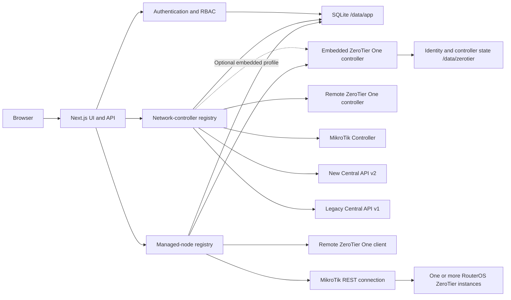

# Architecture

This page is the map behind the interface. It explains how the pieces fit
together, where data lives, and why controllers and managed nodes are modeled
separately. If you are adding a provider or tracing a request, start here.

## System shape



The standard container keeps things intentionally simple: the application and
SQLite, with no TUN device or elevated network capabilities. It connects to the
controllers you choose, and the web API is the only management layer exposed to
the browser.

An opt-in `embedded-runtime` target adds ZeroTier One and binds its local
Service API only inside the container. That target compiles the upstream
source with `ZT_NONFREE=1`, so it is subject to the separate controller license
described in [Embedded controller licensing](EMBEDDED_CONTROLLER.md). Health
requires SQLite in standard mode and additionally requires the local token and
controller API in embedded mode.

## Application layers

1. **UI** — page-focused React screens for Dashboard, Controllers, global Network and Node inventories, controller-scoped Node management, Settings, Profile, Audit, Backup and Diagnostics. User and role administration is embedded in the global Settings area.
2. **API boundary** — validates input sizes and formats, enforces sessions, same-origin writes, permissions, and audit logging.
3. **Domain layer** — separate controller/node registries, metadata, user invariants, Flow Rules compilation, and backup plans.
4. **Adapters** — a network-controller contract and a managed-node contract. Capability flags prevent unsupported controls from appearing.
5. **Persistence** — SQLite in WAL mode with foreign keys and a busy timeout. External credentials and Central tokens are encrypted before storage. Sanitized network/member discovery snapshots support cross-controller search and clearly marked offline fallback; provider APIs remain the source of truth for every write.

The [capability matrix](CAPABILITY_MATRIX.md) keeps the provider differences in
one place. The guiding rule is honest UI: if an upstream API cannot perform an
operation, the application does not pretend that it can.

## Repository layout

The deployable project keeps build, licensing, and operator-facing files at the
repository root. Application source lives under `src/` and is grouped by
responsibility:

```text
src/
├── app/                 Next.js routes, layouts, styles, and API boundaries
├── features/            Page-level UI grouped by product area
│   ├── audit/
│   ├── auth/
│   ├── controllers/
│   ├── diagnostics/
│   ├── networks/
│   ├── nodes/
│   ├── overview/
│   ├── profile/
│   ├── settings/
│   └── users/
├── lib/                 Domain services, adapters, persistence, and shared types
├── shared/
│   ├── hooks/           Cross-feature React hooks
│   ├── layout/          Application shell
│   └── providers/       Authentication and controller context
└── proxy.ts             Request boundary and IP access enforcement
```

Tests remain in `tests/`, deployment entrypoints in `docker/`, operator
documentation in `docs/`, and distributable license material in `licenses/`.
`Dockerfile`, Compose files, package manifests, and tool configuration remain at
the root so a fresh clone is immediately usable as a Docker build context.

Page files and API route handlers should stay thin. Reusable UI belongs to its
owning feature or `shared/`; provider behavior belongs in `lib/adapters`; and
database, authorization, validation, and audit guarantees remain server-side.

## Controller and node association

Controller and managed-node records are separate because the controller API and
client Service API solve different jobs. The UI links
the local node, remote ZeroTier One client, or RouterOS client instance to its
owning registry connection and opens it from that controller card. Central
connections do not receive a node record: their devices are network members,
and Central cannot configure the client service running on those devices.

A MikroTik registry entry represents one authenticated RouterOS REST connection.
The ZeroTier entries below `/zerotier` are child runtime scopes rather than
additional saved credentials. Their names are arbitrary and are never assumed
to be `zt1`. Controller networks, joined client interfaces, and peer rows retain
their RouterOS `instance` reference; the UI selection filters and creates those
resources in the selected scope.

Removing an external controller connection cleans up only the matching local,
encrypted connection record. It never silently leaves networks, uninstalls
software, or deletes anything on the external device.

Controller-scoped pages render a provider-colored context banner containing the
controller name, type, identity, status and page scope. Direct controller URLs
synchronize the active preference. Switching controllers from a network detail
or node page navigates to the new controller's safe index instead of leaving a
page whose route and global selection disagree.

## Global discovery inventories

**Networks** is a controller-neutral catalog rather than a hidden view of the
active controller. Controller, access, state and search filters live in the URL,
so filtered links and browser refreshes are stable. Opening a result carries both
the controller ID and Network ID to the existing provider-scoped editor.

**Nodes** aggregates network membership records by the ten-character ZeroTier
address and merges them with registered managed endpoints when their identities
match. This makes Central-only members discoverable without implying that Central
can configure their local client. A separate Managed endpoints view lists the
actual Service API or RouterOS connections and links to their controller-scoped
workspace.

Discovery requests use bounded concurrency and short in-process response caches.
The last successful network, member and joined-network snapshots are stored in
SQLite so a failed controller does not disappear from search. Cached rows are
always marked stale, never receive writes, exclude adapter `raw` payloads, and
are removed by foreign-key cascades when their local controller or endpoint
record is deleted.

## New Central hierarchy

The registry entry stores an organization ID and an optional selected network
group ID. Groups are read and mutated through the official API v2. The selected
group scopes network creation and is stored in SQLite; switching it does not
modify the remote group. Network reads can fall back to organization scope when
no group is selected.

Organization billing, subscription, IAM and service-account lifecycle are not
part of the network-controller adapter. A token is provisioned in New Central
and then encrypted in this application.

## Identity and controller IDs

In optional embedded mode, the ZeroTier identity is generated by ZeroTier One
on first start and persisted in `/data/zerotier`. The first ten hexadecimal
characters form its node/controller address. A created ZeroTier network ID
begins with that address and adds six random hexadecimal characters.

Restoring or moving the full `/data` volume preserves this identity. Starting with a fresh volume creates a fresh identity.

## Roles

| Role     | Effective access                                                             |
| -------- | ---------------------------------------------------------------------------- |
| Admin    | Controllers, networks, devices, users, audit and CSV export, backup, restore |
| Operator | Read controllers; manage networks/devices; backup and restore                |
| Auditor  | Read controllers/networks/devices; audit and backup export                   |
| Viewer   | Read controllers, networks, and devices                                      |

Every management API performs its own authorization check; hiding a UI action is not the security boundary.

Global application settings are administrator-only and stored in SQLite. The
fixed application label and live refresh interval are returned to authenticated
users; session, retention, and IP access policies remain restricted to
administrators. The IP boundary executes in Next.js Proxy before UI and API
routes, trusts source headers only when `TRUST_PROXY=1`, and exempts only the
container health endpoint. Profile updates are self-service and cannot change
roles or account status. Password changes require the current password and
revoke every session for that user.

Optional two-factor authentication implements [RFC 6238 TOTP](https://datatracker.ietf.org/doc/html/rfc6238)
with the [Google Authenticator Key URI format](https://github.com/google/google-authenticator/wiki/Key-Uri-Format).
Enrollment secrets are encrypted at rest. Recovery codes are high-entropy,
single-use values stored only as keyed hashes. Password verification creates a
hashed, five-minute login challenge; TOTP verification is rate limited and a
time step cannot be replayed. Enabling, disabling, password changes, and
administrator resets revoke existing sessions as appropriate.

## Secret handling

An environment `APP_SECRET` is SHA-256-derived into an encryption key. If omitted, a 256-bit random key is created once in `/data/app/app.secret`. Controller and node credentials are stored as versioned AES-256-GCM payloads with a unique nonce and authentication tag. The secret must stay stable: changing it makes existing encrypted credentials unreadable.

The same application key encrypts TOTP enrollment secrets and keys recovery-code
hashes. Changing or losing it also makes existing two-factor enrollments
unusable; preserve it as part of disaster recovery.

In optional embedded mode, ZeroTier's `authtoken.secret` remains under
`/data/zerotier`; the unprivileged web process receives read-only group access
to that single file during startup. Standard mode has no local ZeroTier token.
