# Interface gallery

This gallery follows the usual path through ZT Control Plane, from sign-in to
day-to-day network work and global administration. Every controller, network,
node, address, account and audit event in these images is fabricated
demonstration data. None of the screenshots contains a real credential or
production environment.

ZT Control Plane is an independent community project. Provider names identify
compatible integrations and do not imply affiliation, sponsorship or
endorsement.

## Sign in

The control plane starts behind its own local account and role system.

[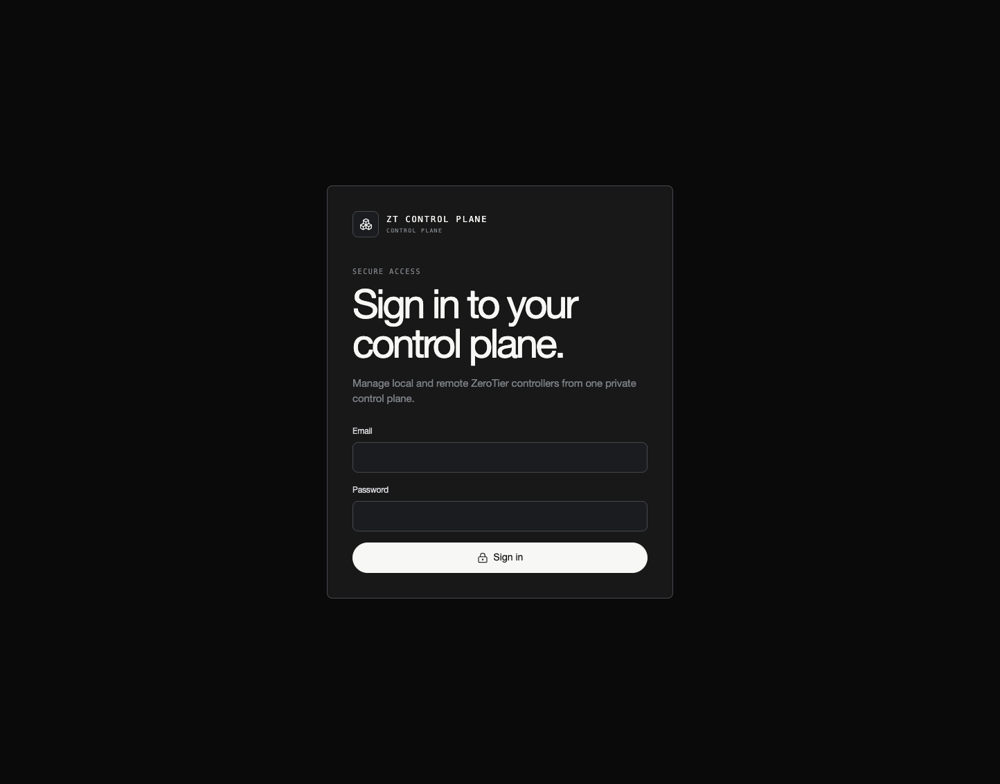](../screenshots/login.png)

## Workspace overview

The overview combines fleet health, controller and network topology, recent
activity and direct navigation to the largest networks.

## Controller registry

Self-hosted ZeroTier One, RouterOS, New Central and Legacy Central connections
share one registry while retaining their individual capabilities and visual
context.

## Managed ZeroTier One node

A ZeroTier One management endpoint exposes joined networks, route-acceptance
settings, peers, standard Planet roots and optional custom Moons.

[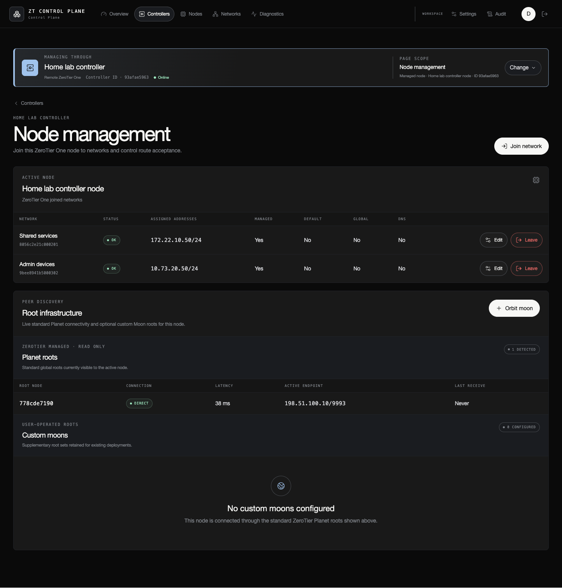](../screenshots/node-zerotier-one.png)

## RouterOS instances

A RouterOS connection can contain several independent ZeroTier instances. The
workspace presents each instance's controller, client, peer and runtime roles
without assuming a fixed instance name.

## Cross-controller network inventory

The global inventory searches every connected provider while keeping the
owning controller visible on every row.

Filters can narrow the same inventory to a controller, access mode, state or
search term.

[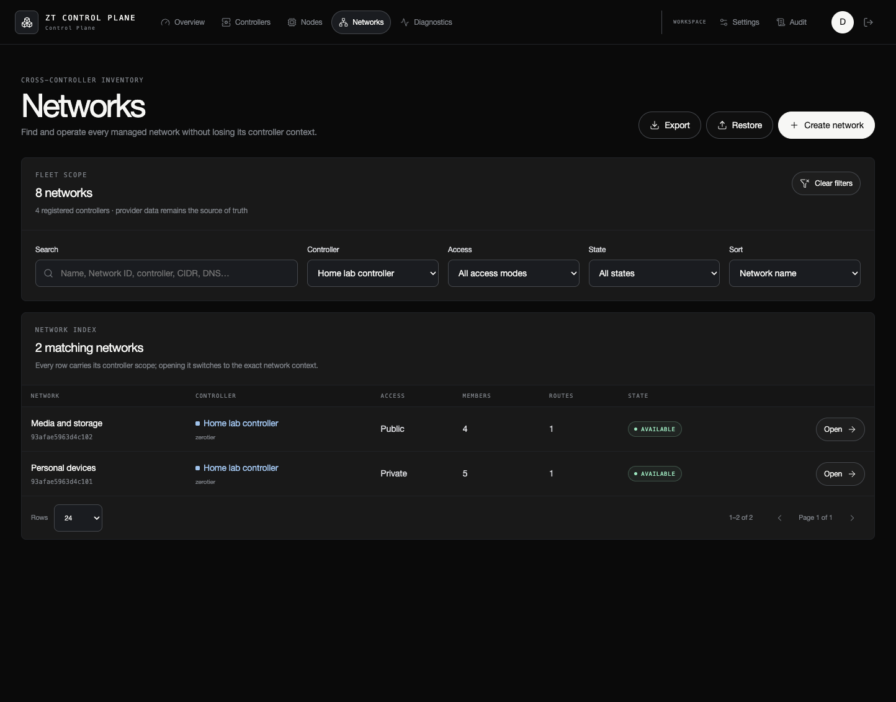](../screenshots/network-inventory-filtered.png)

## Network members

Network pages retain their controller context and expose only the tabs and
operations supported by that provider.

Member details include authorization, managed addresses, bridging, assignment
behavior, capabilities and tags where the provider supports them.

[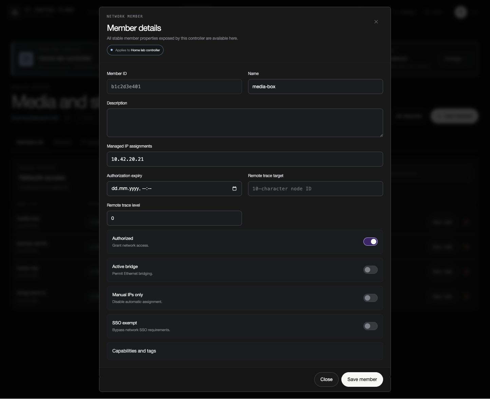](../screenshots/member-details.png)

## Node inventory

The node inventory separates directly managed endpoints from membership-only
identities discovered across controller networks.

[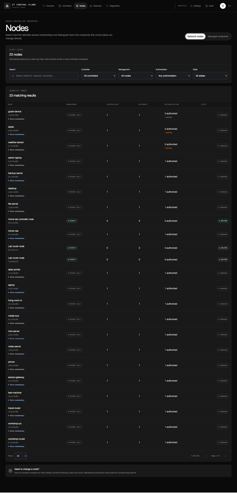](../screenshots/node-inventory.png)

## Diagnostics

Diagnostics turn provider responses into service health, controller readiness,
peer paths, joined interfaces and capability summaries. Raw responses remain
available as an advanced troubleshooting view.

[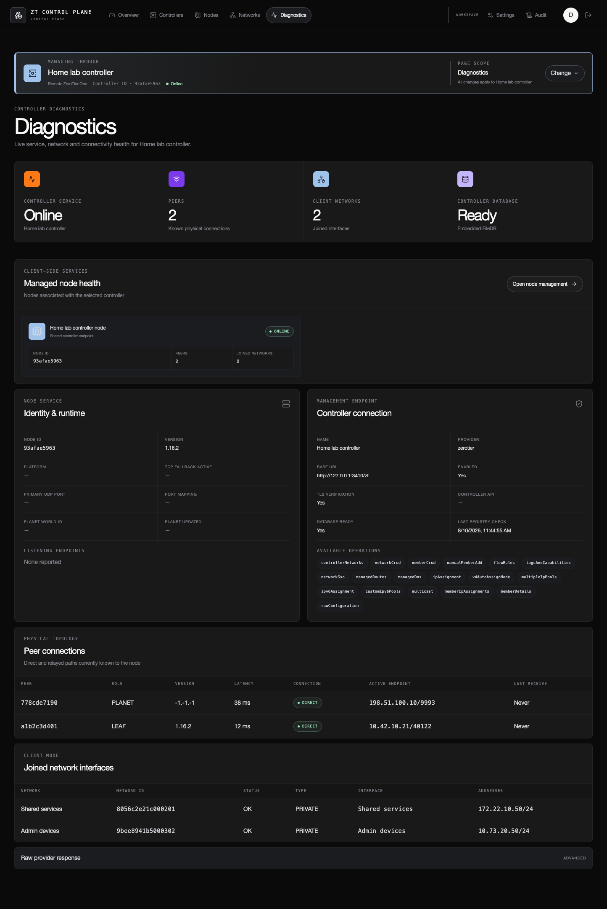](../screenshots/diagnostics.png)

## Security settings

Global settings cover session policy, audit retention, IP access rules and the
current deployment posture. This screenshot intentionally shows the warnings
raised by a local HTTP demonstration environment; production deployments
should follow the [deployment guide](DEPLOYMENT.md) and
[security model](SECURITY_MODEL.md).

[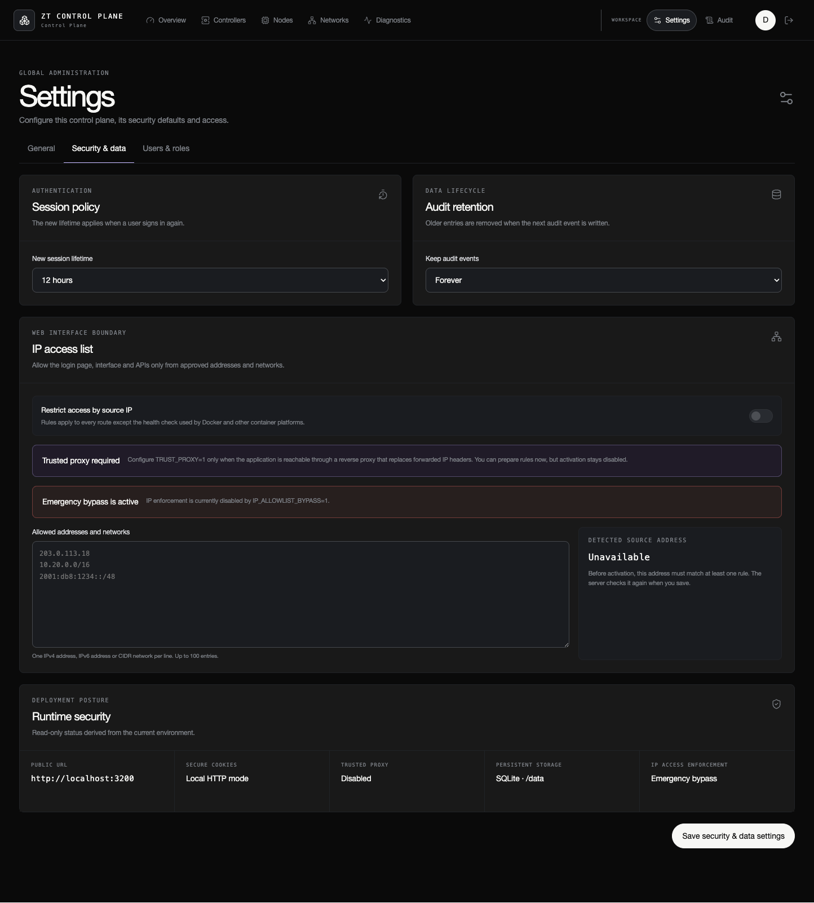](../screenshots/settings-security.png)

## Users and roles

Administrators can assign Admin, Operator, Auditor or Viewer access and keep
the granted role as small as the person's work allows.

[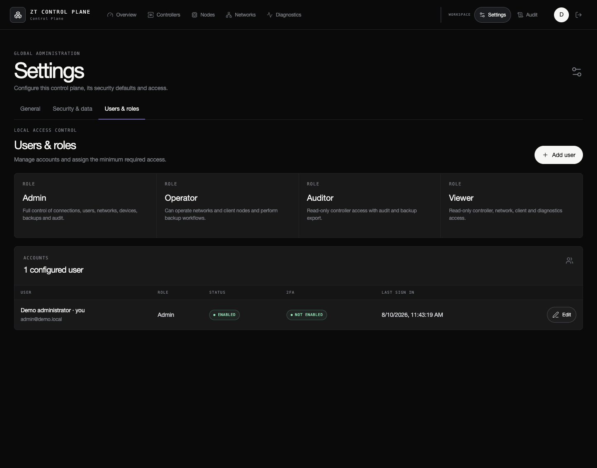](../screenshots/users-and-roles.png)

The user dialog keeps account creation focused on identity, role and initial
credentials.

[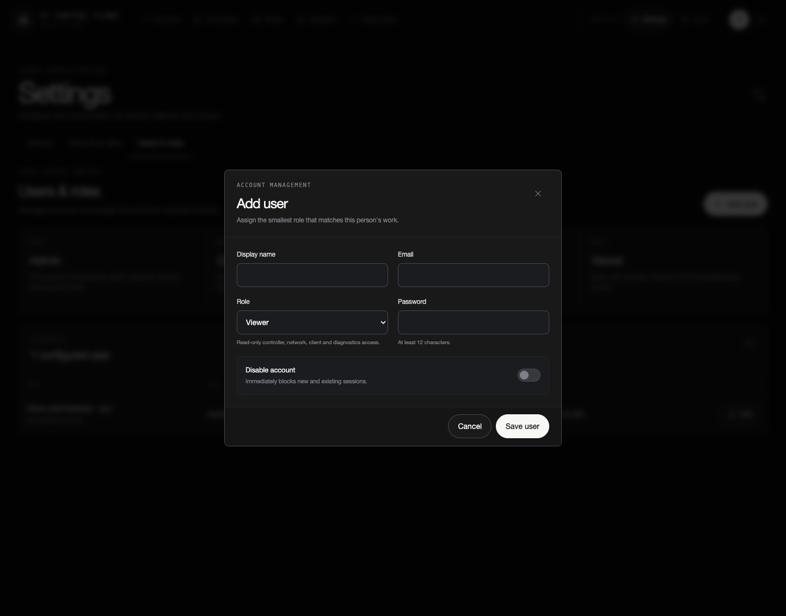](../screenshots/add-user.png)

## Audit history

Controller, member, authentication and configuration operations are searchable,
filterable and exportable. The older controller labels visible in this
demonstration history are also fabricated records retained to illustrate
renames over time.

[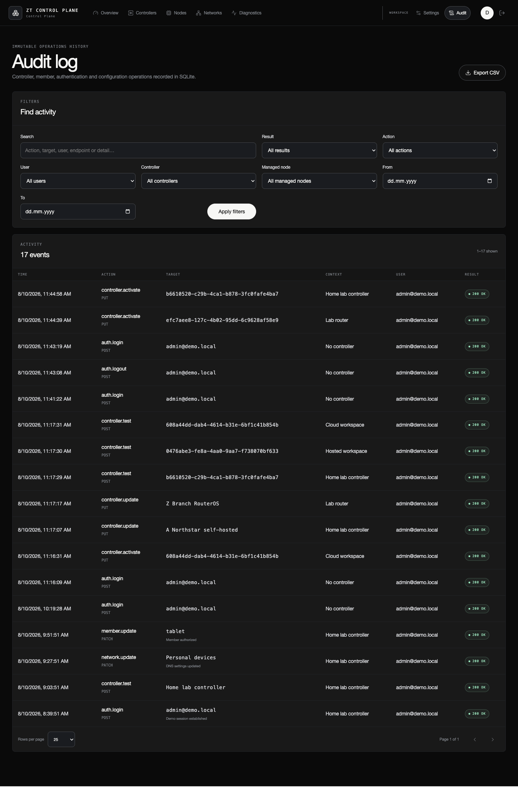](../screenshots/audit-log.png)

## Personal profile

Each user can manage identity details, interface preferences, password and TOTP
two-factor authentication from a personal profile.

[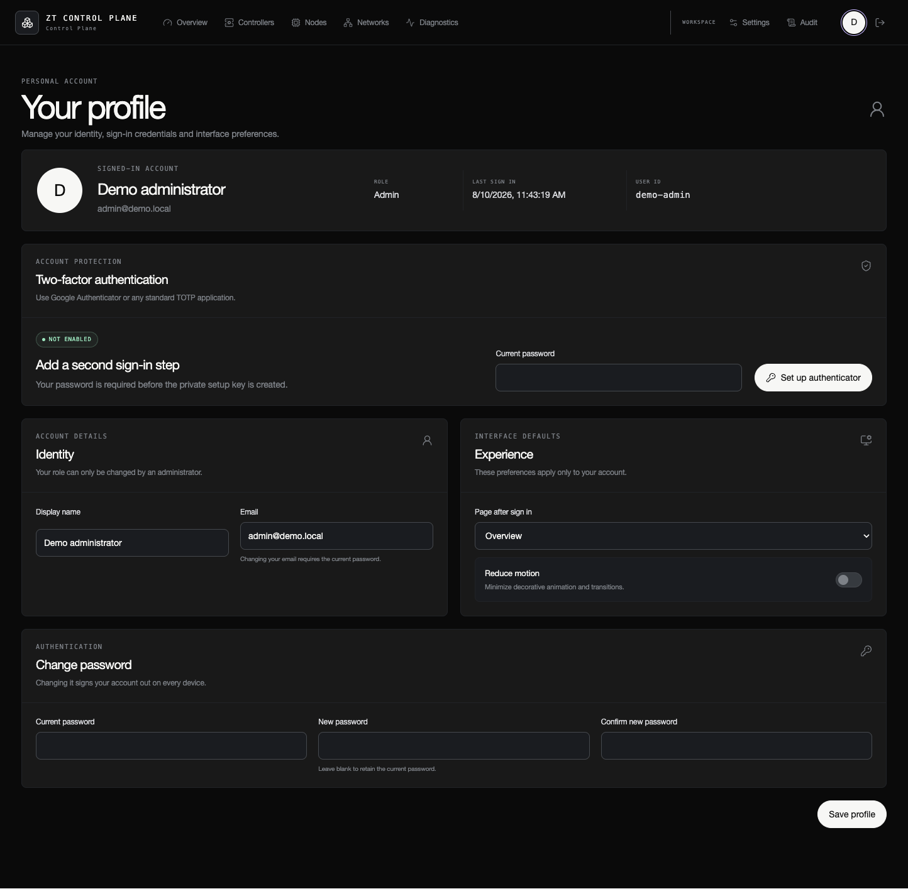](../screenshots/user-profile.png)

Return to the [project overview](../README.md) or continue with the
[deployment guide](DEPLOYMENT.md).
